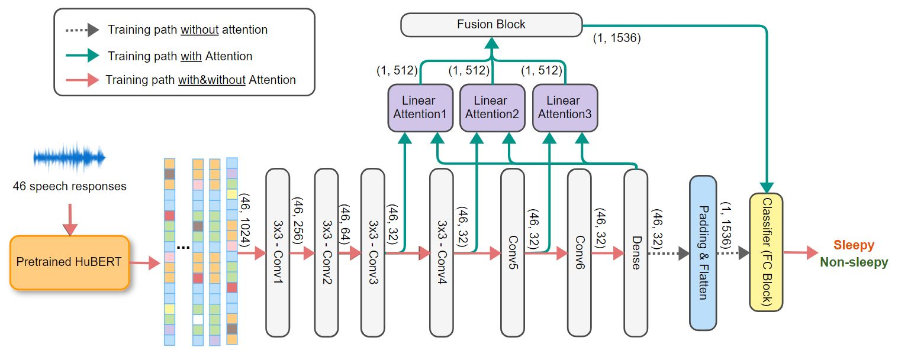
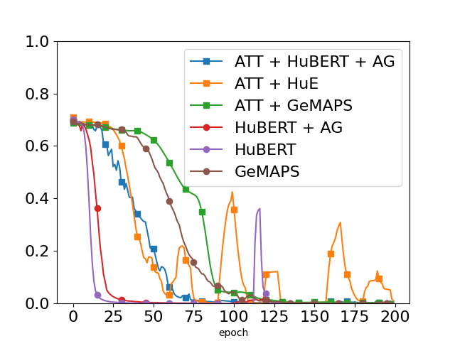
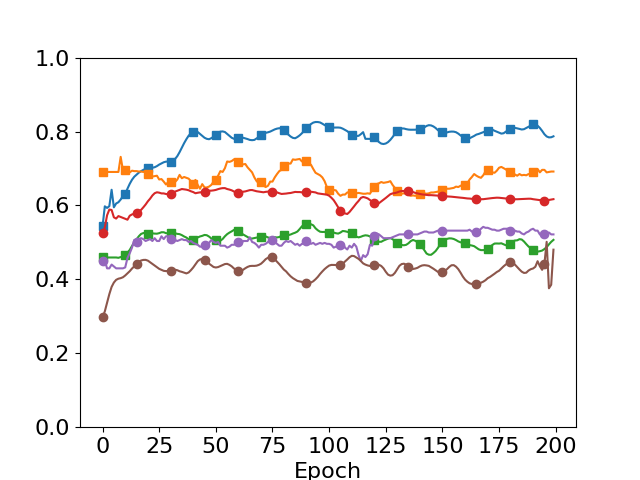

# AttentionSleepiness for CHASE2022
Project goal:
Applying attention mechanism in Voiceome dataset to determine sleepiness sates of speaker with HuBERT embedding.

## Bash Command
#### No-Attention mechaninsm
```bash
python3 train.py\
--attention=0\
--learning_rate=0.001 --batch_size=64 --epoch=200\
--feature=HuBERT
```
Use *--feature=GeMAPS* to train the model with GeMAPS feature 

#### With Attention mechanism
```bash
python3 train.py\
--attention=1\
--learning_rate=0.001 --batch_size=64 --epoch=200\
--feature=HuBERT\
--age_gender=1
```
Use *--age_gender=1* to add age + gender as complement features to classifier layers  

### CNN-Attention Model Architecture


### Data distribution (Voiceome sessions)
<table align="center">
<tr><th>Gender vs. Sleepiness</th><th> Age vs. Gender </th></tr>
<tr><td align="top">

|Gender | Non-Sleepy(1-3) | Sleepy (4-7) | Total|
|:-------:|:-----------------:|:-------------:|:------:|
| Female|     1,097       |      206     |1,303 |
| Male  |     620       |      93     |713 |
| Other  |    18       |     6     | 24 |
| **Total**  |    **1,735**  | **305**     |**2,040**|

</td><td>

|Age |Female | Male | Others | **Total** |
|:---:|---:|---:|---:|---:|
|18-19 | 54| 22 |  3 | **79** |
| 20-29 | 487 | 286 | 14 | **787** |
| 30-39 | 391 | 250 | 7 | **648** |
| 40-49 | 190 | 90 | 0 | **280** |
| 50-59 | 109 | 33 | 0 | **142** |
| 60-69 | 54  | 25 | 0 | **79** |
| ≥ 70| 18 | 7 | 0 | **25** |
| **Total** | **1,303** | **713** | **24** | **2,040**|

</td></tr> </table>

## Experiment results
Epoch = 200, lr=1e-4, batch_size=64

Training loss             |  Test accuracy
:-------------------------:|:-------------------------:
  |  


## Speech tasks
| Task   | Response columns | Speech task description | ICASSP2022's Result |
| ------ | ---------------- | ------------ |:------------------:|
| Task 1 | response1        | Microphone test | 69.70% |
| Task 2 | response2        | Free speech | 77.24% |
| Task 3 | response3        | Picture description | 70.66% |
| Task 4 | response4        | Category nameing | 75.0% |
| Task 5 | response5        | Phonemic fluency | 78.34% |
| Task 6 | response6        | Paragraph reading | 73.14% |
| Task 7 | response7        | Sustained phonation | 77.68% |
| Task 8 | response8        | Diadochokinetic (puh-puh-puh)| 67.61% |
| Task 9 | response9        | Diadochokinetic (puh-tuh-kuh) | 69.83% |
| Task 10| response10,..., response34 | Confrontational naming | 81.13% |
| Task 11| response35,..., response44| Non-word pronuciation | 78.66% |
| Task 12| response46, response48 | Memory recall | 80.87% |
| **All tasks** | _all above_ | _all above_ | **_81.29%_** |

### Audio length distribution
|Response | Longest (sec) | Shortest (sec) | Mean (sec) | Median | Std. Dev |
|---|---|:---:|:---:|:---:|:---:|
|response1 | 10.4107 | 0.9387 | 5.5258 |5.2053 | 1.5806 |
|response2 | 60.9280 | 31.2320 | 59.5714 |59.9040 | 1.6216 |
|response3 | 60.8427 | 33.2800 | 59.5793 |59.9040 | 1.5586 |
|response4 | 60.8427 | 9.9840 | 59.5738 |59.9040 | 1.7889 |
|response5 | 60.7573 | 30.7200 | 59.5504 |59.9040 | 1.7045 |
|response6 | 60.5867 | 1.4507 | 59.0024 |59.9040 | 5.0277 |
|response7 | 30.8053 | 0.0853 | 18.6302 |17.5787 | 7.3057 |
|response8 | 10.0693 | 5.9733 | 9.8531 |9.8987 | 0.2317 |
|response9 | 10.2168 | 5.7173 | 9.8486 |9.8987 | 0.2529 |
|response10 | 10.4107 | 0.8533 | 4.2560 |3.0720 | 2.7084 |
|response11 | 9.9840 | 0.0853 | 3.2173 |2.2187 | 2.6539 |
|response12 | 10.6667 | 0.1707 | 3.0358 |1.9627 | 2.7262 |
|response13 | 9.9840 | 0.0853 | 3.5961 |2.6006 | 2.6130 |
|response14 | 10.5813 | 0.1707 | 2.9992 |2.0434 | 2.6334 |
|response15 | 10.3097 | 0.1707 | 3.1422 |2.1333 | 2.6028 |
|response16 | 10.1547 | 0.0853 | 2.7521 |1.7920 | 2.5984 |
|response17 | 9.9840 | 0.1707 | 2.9055 |1.9627 | 2.5845 |
|response18 | 9.9840 | 0.0853 | 2.9825 |2.0434 | 2.6015 |
|response19 | 10.5883 | 0.1707 | 3.1836 |2.2187 | 2.5468 |
|response20 | 9.9840 | 0.1707 | 3.4731 |2.3893 | 2.6480 |
|response21 | 10.1547 | 0.0853 | 2.7950 |1.7920 | 2.5863 |
|response22 | 9.9840 | 0.1707 | 3.2859 |2.4149 | 2.4606 |
|response23 | 10.7520 | 0.0853 | 2.7405 |1.7920 | 2.5612 |
|response24 | 10.5813 | 0.1707 | 2.9188 |1.8773 | 2.6231 |
|response25 | 9.9840 | 0.1707 | 3.4071 |2.3220 | 2.6276 |
|response26 | 10.6667 | 0.0853 | 2.9781 |2.0480 | 2.5239 |
|response27 | 10.1547 | 0.3413 | 2.8075 |1.8773 | 2.5425 |
|response28 | 10.0693 | 0.3413 | 2.7435 |1.7647 | 2.6167 |
|response29 | 10.2400 | 0.2560 | 2.7085 |1.8576 | 2.5228 |
|response30 | 10.0693 | 0.1707 | 2.5730 |1.6718 | 2.5790 |
|response31 | 10.3253 | 0.2560 | 2.9359 |1.9627 | 2.5845 |
|response32 | 10.6667 | 0.2560 | 2.8283 |1.8576 | 2.5886 |
|response33 | 10.0693 | 0.0929 | 2.7381 |1.7920 | 2.5616 |
|response34 | 10.4107 | 0.3200 | 2.8480 |1.7920 | 2.6486 |
|response35 | 33.1581 | 0.6613 | 3.4351 |2.6006 | 2.4521 |
|response36 | 10.5813 | 0.2560 | 2.9889 |2.2187 | 2.3682 |
|response37 | 10.8373 | 0.2560 | 2.5272 |1.7067 | 2.4200 |
|response38 | 9.9840 | 0.1707 | 2.5972 |1.7920 | 2.4124 |
|response39 | 10.6667 | 0.1707 | 2.5340 |1.7647 | 2.4030 |
|response40 | 10.3253 | 0.0853 | 2.6174 |1.8576 | 2.3880 |
|response41 | 10.5813 | 0.1707 | 2.4809 |1.7067 | 2.4208 |
|response42 | 10.7741 | 0.0853 | 2.5249 |1.7647 | 2.3871 |
|response43 | 10.1547 | 0.1707 | 2.4362 |1.6213 | 2.4040 |
|response44 | 10.5813 | 0.1707 | 2.5119 |1.7647 | 2.3702 |
|response46 | 15.7867 | 0.0853 | 6.1618 |5.3815 | 3.0466 |
|response48 | 15.8720 | 0.0853 | 7.3616 |6.9120 | 3.0406 |
