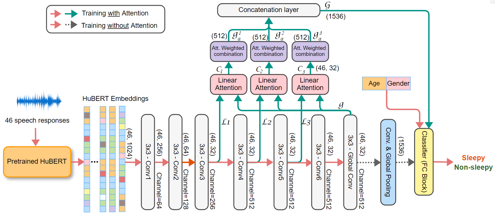
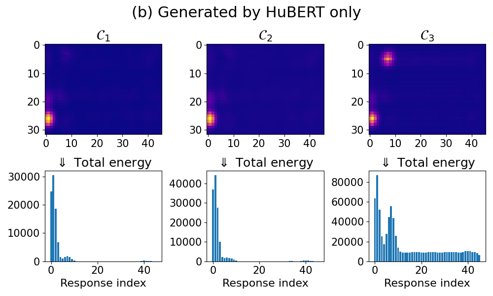

# AttentionSleepiness for ICC2023
Project goal:
In this project, we propose an attention-based sleepiness detection method using HuBERT embeddings and eGeMAPS features of human speech.
The attention-based CNN model achieves accuracy of 82.57% on sleepiness detection using HuBERT embeddings plus age and gender as inputs.
We also show that the embedded attention layers improve the detection accuracy in different cases of inputs. 
We explore the attention weights from the attention layers and observe that the long and semantically-different responses from
“Picture description”, “Microphone test”, and “Free speech” tasks are more relevant to sleepiness detection when the model is
trained with HuBERT only; the short and semantically-similar responses from “Sustained phonation” and “Diadochokinetic” tasks are
more relevant when trained with HuBERT plus age and gender.

## Bash Command
#### No-Attention mechaninsm
```bash
python3 train.py\
--attention=0\
--learning_rate=0.001 --batch_size=64 --epoch=200\
--feature=HuBERT
```
Use *--feature=GeMAPS* to train the model with GeMAPS feature 

#### With Attention mechanism
```bash
python3 train.py\
--attention=1\
--learning_rate=0.001 --batch_size=64 --epoch=200\
--feature=HuBERT\
--age_gender=1
```
Use *--age_gender=1* to add age + gender as complement features to classifier layers  

### CNN-Attention Model Architecture


### Data distribution (Voiceome sessions)
<table align="center">
<tr><th>Gender vs. Sleepiness</th><th> Age vs. Gender </th></tr>
<tr><td align="top">

|Gender | Non-Sleepy(1-3) | Sleepy (4-7) | Total|
|:-------:|:-----------------:|:-------------:|:------:|
| Female|     1,097       |      206     |1,303 |
| Male  |     620       |      93     |713 |
| Other  |    18       |     6     | 24 |
| **Total**  |    **1,735**  | **305**     |**2,040**|

</td><td>

|Age |Female | Male | Others | **Total** |
|:---:|---:|---:|---:|---:|
|18-19 | 54| 22 |  3 | **79** |
| 20-29 | 487 | 286 | 14 | **787** |
| 30-39 | 391 | 250 | 7 | **648** |
| 40-49 | 190 | 90 | 0 | **280** |
| 50-59 | 109 | 33 | 0 | **142** |
| 60-69 | 54  | 25 | 0 | **79** |
| ≥ 70| 18 | 7 | 0 | **25** |
| **Total** | **1,303** | **713** | **24** | **2,040**|

</td></tr> </table>

## Experiment results
Epoch = 200, lr=$1e^{-4}$, batch_size=64

#### Accuracy on test data (max over epochs)
&nbsp; | HUBERT + A +G | HuBERT | eGeMAPS | eGeMAPS + A + G 
|---|:---:|:---:|:---:|:---:|
|With Attention | 82.57% | 73.14% | 50.67% | 60.66% |
|W/o Attention | 64.68% | 54.20% | 50.15% | 50.18%

Training loss             |  Test accuracy
:---:|:---:
  |  
  |  


## Annalyzing the attention scores
The output of Linear Attention blocks are considered as attention maps. It has size of (46x32) when model is trained with HuBERT+Age+Gender/HuBERT-only, and has size of (46x11) when the model is trained with eGEMAPS features.

We ran the trained model on testing data (408 speech-sessions), and then derives the average attention maps. When showing an attention map as a heatmap, we can see the hot location where the attention score is higher than other points. To determine the which column (which corresponds to a speech response) in the heatmap has highest energy, we calculate the sum of opsitive values in each column. Eventually, the output vector (1 x 46) represent the relevant scores of 46 speech-responses.


|Attention map| Attention map| 
:-------------------------:|:-------------------------:
  |  

#### HuBER + Age + Gender

---| 3 most relevant responses | 5 most relevant responses | 10 most relevant<br>responses |
|---|---|---|---|
$\mathcal{C}_1$|[6, 8, 7] | [42,  9,  6,  8,  7] | [ 5, 37, 44, 41, 43, 42,  9,  6,  8,  7]
$\mathcal{C}_2$|[6, 8, 7] | [42,  9,  6,  8,  7] | [ 1, 46, 44, 41, 43, 42,  9,  6,  8,  7]
$\mathcal{C}_3$|[6, 8, 7] | [9,  42,  6,  8,  7] | [20, 37, 44, 41, 43,  9, 42,  6,  8,  7]

#### HuBERT-Only
---| 3 most relevant responses | 5 most relevant responses | 10 most relevant responses |
|---|---|---|---|
$\mathcal{C}_1$|[3, 1, 2] | [8, 4, 3, 1, 2]| [10,  6,  5,  9,  7,  8,  4,  3,  1,  2]
$\mathcal{C}_2$|[3, 1, 2] | [7, 4, 3, 1, 2] | [10,  6,  9,  5,  8,  7,  4,  3,  1,  2]
$\mathcal{C}_3$|[8, 1, 2] | [7, 3, 8, 1, 2] | [ 5,  4, 10,  6,  9,  7,  3,  8,  1,  2]


## Speech tasks
| Task   | Response columns | Speech task description | ICASSP2022's Result |
| ------ | ---------------- | ------------ |:------------------:|
| Task 1 | response1        | Microphone test | 69.70% |
| Task 2 | response2        | Free speech | 77.24% |
| Task 3 | response3        | Picture description | 70.66% |
| Task 4 | response4        | Category nameing | 75.0% |
| Task 5 | response5        | Phonemic fluency | 78.34% |
| Task 6 | response6        | Paragraph reading | 73.14% |
| Task 7 | response7        | Sustained phonation | 77.68% |
| Task 8 | response8        | Diadochokinetic (puh-puh-puh)| 67.61% |
| Task 9 | response9        | Diadochokinetic (puh-tuh-kuh) | 69.83% |
| Task 10| response10,..., response34 | Confrontational naming | 81.13% |
| Task 11| response35,..., response44| Non-word pronuciation | 78.66% |
| Task 12| response46, response48 | Memory recall | 80.87% |
| **All tasks** | _all above_ | _all above_ | **_81.29%_** |


## Number of spoken words per Task, Gender, 
<table>
<tr align="center">
    <td rowspan="3">Speech Task</td>
    <td rowspan="3">Responses</td>
    <td rowspan="2" colspan="2">Overall</td>
    <td colspan="6">Gender</td>
    <td colspan="6">Age</td>
</tr>
<tr align="center">
    <td colspan="2">Male</td>
    <td colspan="2">Female</td>
    <td colspan="2">Other</td>
    <td colspan="2">18-39</td>
    <td colspan="2">40-64</td>
    <td colspan="2">>=65</td>
</tr>
<tr align="center">
    <td>Length</td>
    <td>Words</td>
    <td>Length</td>
    <td>Words</td>
    <td>Length</td>
    <td>Words</td>
    <td>Length</td>
    <td>Words</td>
    <td>Length</td>
    <td>Words</td>
    <td>Length</td>
    <td>Words</td>
    <td>Length</td>
    <td>Words</td>
</tr>
<tr align="center">
    <td>$T_1$ Microphone test</td>
    <td>$Resp._1$</td>
    <td>5.5</td>
    <td>9</td>
    <td>5.6</td>
    <td>9</td>
    <td>5.5</td>
    <td>9</td>
    <td>5.0</td>
    <td>9</td>
    <td>5.4</td>
    <td>9</td>
    <td>5.9</td>
    <td>9</td>
    <td>6.5</td>
    <td>9</td>
</tr>

<tr align="center">
    <td>$T_2$ Free speech test</td>
    <td>$Resp._2$</td>
    <td>56.9</td>
    <td>80</td>
    <td>59.4</td>
    <td>83</td>
    <td>59.7</td>
    <td>79</td>
    <td>59.6</td>
    <td>88</td>
    <td>59.6</td>
    <td>82</td>
    <td>59.4</td>
    <td>75</td>
    <td>59.5</td>
    <td>79</td>
</tr>

<tr align="center">
    <td>$T_3$ Picture description</td>
    <td>$Resp._3$</td>
    <td>59.6</td>
    <td>113</td>
    <td>59.4</td>
    <td>109</td>
    <td>59.7</td>
    <td>115</td>
    <td>59.7</td>
    <td>121</td>
    <td>59.6</td>
    <td>114</td>
    <td>59.4</td>
    <td>111</td>
    <td>59.6</td>
    <td>114</td>
</tr>

<tr align="center">
    <td>$T_4$ Category naming </td>
    <td>$Resp._4$</td>
    <td>59.6</td>
    <td>33</td>
    <td>59.4</td>
    <td>32</td>
    <td>59.6</td>
    <td>33</td>
    <td>59.6</td>
    <td>35</td>
    <td>59.6</td>
    <td>33</td>
    <td>59.5</td>
    <td>33</td>
    <td>59.8</td>
    <td>35</td>
</tr>

<tr align="center">
    <td>$T_5$ Phonemic fluency</td>
    <td>$Resp._5$</td>
    <td>59.6</td>
    <td>22</td>
    <td>59.4</td>
    <td>21</td>
    <td>59.6</td>
    <td>22</td>
    <td>59.6</td>
    <td>23</td>
    <td>59.6</td>
    <td>22</td>
    <td>59.4</td>
    <td>22</td>
    <td>59.7</td>
    <td>23</td>
</tr>

<tr align="center">
    <td>$T_6$ Paragraph reading</td>
    <td>$Resp._6$</td>
    <td>59</td>
    <td>156</td>
    <td>58.8</td>
    <td>155</td>
    <td>59.1</td>
    <td>157</td>
    <td>59.7</td>
    <td>165</td>
    <td>58.9</td>
    <td>158</td>
    <td>59.2</td>
    <td>155</td>
    <td>58.9</td>
    <td>140</td>
</tr>
<tr align="center">
    <td>$T_7$ Sustained phonation</td>
    <td>$Resp._7$</td>
    <td>18.6</td>
    <td>3</td>
    <td>20.2</td>
    <td>4</td>
    <td>17.8</td>
    <td>3</td>
    <td>17.8</td>
    <td>3</td>
    <td>18.9</td>
    <td>3</td>
    <td>18.1</td>
    <td>3</td>
    <td>16.8</td>
    <td>3</td>
</tr>


<tr align="center">
    <td>$T_8$ Diadochokinetic (puh-puh-puh)</td>
    <td>$Resp._8$</td>
    <td>9.9</td>
    <td>7</td>
    <td>9.8</td>
    <td>9</td>
    <td>9.6</td>
    <td>6</td>
    <td>9.9</td>
    <td>6</td>
    <td>9.9</td>
    <td>7</td>
    <td>9.8</td>
    <td>7</td>
    <td>9.9</td>
    <td>8</td>
</tr>

<tr align="center">
    <td>$T_9$ Diadochokinetic (puh-tuh-kuh)</td>
    <td>$Resp._9$</td>
    <td>9.8</td>
    <td>9</td>
    <td>9.8</td>
    <td>10</td>
    <td>9.9</td>
    <td>9</td>
    <td>9.9</td>
    <td>10</td>
    <td>9.9</td>
    <td>9</td>
    <td>9.8</td>
    <td>9</td>
    <td>9.9</td>
    <td>9</td>
</tr>

<tr align="center">
    <td>$T_{10}$ Confrontational naming</td>
    <td>$Resp._{10}\dots Resp._{34}$</td>
    <td>75.9</td>
    <td>36</td>
    <td>80.5</td>
    <td>36</td>
    <td>73.3</td>
    <td>36</td>
    <td>76.9</td>
    <td>44</td>
    <td>76</td>
    <td>36</td>
    <td>76.1</td>
    <td>35</td>
    <td>70.5</td>
    <td>37</td>
</tr>

<tr align="center">
    <td>$T_{11}$ Non-word pronunciation</td>
    <td>$Resp._{35}\dots Resp._{44}$</td>
    <td>26.7</td>
    <td>10</td>
    <td>28.2</td>
    <td>10</td>
    <td>25.9</td>
    <td>10</td>
    <td>22.1</td>
    <td>10</td>
    <td>26.2</td>
    <td>10</td>
    <td>28.2</td>
    <td>10</td>
    <td>26.9</td>
    <td>10</td>
</tr>

<tr align="center">
    <td>$T_{12}$ Memory recall</td>
    <td>$Resp._{45}, Resps._{46}$</td>
    <td>13.5</td>
    <td>23</td>
    <td>14.1</td>
    <td>23</td>
    <td>13.2</td>
    <td>23</td>
    <td>13.4</td>
    <td>24</td>
    <td>23.6</td>
    <td>23</td>
    <td>13.3</td>
    <td>22</td>
    <td>14.2</td>
    <td>20</td>
</tr>
</table>


### Audio length distribution
|Response | Longest (sec) | Shortest (sec) | Mean (sec) | Median | Std. Dev | Total length |
|---|:---:|:---:|:---:|:---:|:---:|---:|
|response1 | 10.4107 | 0.9387 | 5.5258 |5.2053 | 1.5806 |3361.3762|
|response2 | 60.9280 | 31.2320 | 59.5714 |59.9040 | 1.6216 |36317.5233|
|response3 | 60.8427 | 33.2800 | 59.5793 |59.9040 | 1.5586 |36327.3652|
|response4 | 60.8427 | 9.9840 | 59.5738 |59.9040 | 1.7889 |36328.3267|
|response5 | 60.7573 | 30.7200 | 59.5504 |59.9040 | 1.7045 |36297.1770|
|response6 | 60.5867 | 1.4507 | 59.0024 |59.9040 | 5.0277 |35845.7503|
|response7 | 30.8053 | 0.0853 | 18.6302 |17.5787 | 7.3057 |11194.2338|
|response8 | 10.0693 | 5.9733 | 9.8531 |9.8987 | 0.2317 |6005.5964|
|response9 | 10.2168 | 5.7173 | 9.8486 |9.8987 | 0.2529 |6002.5583|
|response10 | 10.4107 | 0.8533 | 4.2560 |3.0720 | 2.7084 |2622.5649|
|response11 | 9.9840 | 0.0853 | 3.2173 |2.2187 | 2.6539 |1948.4288|
|response12 | 10.6667 | 0.1707 | 3.0358 |1.9627 | 2.7262 |1837.0768|
|response13 | 9.9840 | 0.0853 | 3.5961 |2.6006 | 2.6130 |2221.7136|
|response14 | 10.5813 | 0.1707 | 2.9992 |2.0434 | 2.6334 |1839.0815|
|response15 | 10.3097 | 0.1707 | 3.1422 |2.1333 | 2.6028 |1966.8946|
|response16 | 10.1547 | 0.0853 | 2.7521 |1.7920 | 2.5984 |1683.1720|
|response17 | 9.9840 | 0.1707 | 2.9055 |1.9627 | 2.5845 |1783.7122|
|response18 | 9.9840 | 0.0853 | 2.9825 |2.0434 | 2.6015 |1815.8990|
|response19 | 10.5883 | 0.1707 | 3.1836 |2.2187 | 2.5468 |1962.1343|
|response20 | 9.9840 | 0.1707 | 3.4731 |2.3893 | 2.6480 |2152.8721|
|response21 | 10.1547 | 0.0853 | 2.7950 |1.7920 | 2.5863 |1717.2177|
|response22 | 9.9840 | 0.1707 | 3.2859 |2.4149 | 2.4606 |2010.5729|
|response23 | 10.7520 | 0.0853 | 2.7405 |1.7920 | 2.5612 |1662.0546|
|response24 | 10.5813 | 0.1707 | 2.9188 |1.8773 | 2.6231 |1829.6488|
|response25 | 9.9840 | 0.1707 | 3.4071 |2.3220 | 2.6276 |2099.9144|
|response26 | 10.6667 | 0.0853 | 2.9781 |2.0480 | 2.5239 |1819.7854|
|response27 | 10.1547 | 0.3413 | 2.8075 |1.8773 | 2.5425 |1714.8508|
|response28 | 10.0693 | 0.3413 | 2.7435 |1.7647 | 2.6167 |1667.7162|
|response29 | 10.2400 | 0.2560 | 2.7085 |1.8576 | 2.5228 |1645.7539|
|response30 | 10.0693 | 0.1707 | 2.5730 |1.6718 | 2.5790 |1550.0391|
|response31 | 10.3253 | 0.2560 | 2.9359 |1.9627 | 2.5845 |1780.3231|
|response32 | 10.6667 | 0.2560 | 2.8283 |1.8576 | 2.5886 |1702.0272|
|response33 | 10.0693 | 0.0929 | 2.7381 |1.7920 | 2.5616 |1641.2585|
|response34 | 10.4107 | 0.3200 | 2.8480 |1.7920 | 2.6486 |1716.5540|
|response35 | 33.1581 | 0.6613 | 3.4351 |2.6006 | 2.4521 |2090.5050|
|response36 | 10.5813 | 0.2560 | 2.9889 |2.2187 | 2.3682 |1797.2338|
|response37 | 10.8373 | 0.2560 | 2.5272 |1.7067 | 2.4200 |1510.8905|
|response38 | 9.9840 | 0.1707 | 2.5972 |1.7920 | 2.4124 |1556.8666|
|response39 | 10.6667 | 0.1707 | 2.5340 |1.7647 | 2.4030 |1518.1806|
|response40 | 10.3253 | 0.0853 | 2.6174 |1.8576 | 2.3880 |1556.3269|
|response41 | 10.5813 | 0.1707 | 2.4809 |1.7067 | 2.4208 |1484.0310|
|response42 | 10.7741 | 0.0853 | 2.5249 |1.7647 | 2.3871 |1515.4283|
|response43 | 10.1547 | 0.1707 | 2.4362 |1.6213 | 2.4040 |1461.5686|
|response44 | 10.5813 | 0.1707 | 2.5119 |1.7647 | 2.3702 |1500.0448|
|response46 | 15.7867 | 0.0853 | 6.1618 |5.3815 | 3.0466 |3757.9015|
|response48 | 15.8720 | 0.0853 | 7.3616 |6.9120 | 3.0406 |4553.3954|
