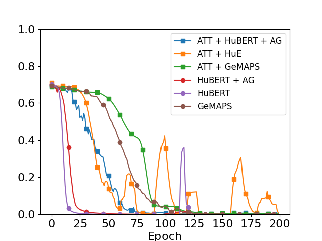

# AttentionSleepiness for CHASE2022
Project goal:
Applying attention mechanism in Voiceome dataset to determine sleepiness sates of speaker with HuBERT embedding.

## Bash Command
#### No-Attention mechaninsm
```bash
python3 train.py\
--attention=0\
--learning_rate=0.001 --batch_size=64 --epoch=200\
--feature=HuBERT
```
Use *--feature=GeMAPS* to train the model with GeMAPS feature 

#### With Attention mechanism
```bash
python3 train.py\
--attention=1\
--learning_rate=0.001 --batch_size=64 --epoch=200\
--feature=HuBERT\
--age_gender=1
```
Use *--age_gender=1* to add age + gender as complement features to classifier layers  

### CNN-Attention Model Architecture


### Data distribution (Voiceome sessions)
<table align="center">
<tr><th>Gender vs. Sleepiness</th><th> Age vs. Gender </th></tr>
<tr><td align="top">

|Gender | Non-Sleepy(1-3) | Sleepy (4-7) | Total|
|:-------:|:-----------------:|:-------------:|:------:|
| Female|     1,097       |      206     |1,303 |
| Male  |     620       |      93     |713 |
| Other  |    18       |     6     | 24 |
| **Total**  |    **1,735**  | **305**     |**2,040**|

</td><td>

|Age |Female | Male | Others | **Total** |
|:---:|---:|---:|---:|---:|
|18-19 | 54| 22 |  3 | **79** |
| 20-29 | 487 | 286 | 14 | **787** |
| 30-39 | 391 | 250 | 7 | **648** |
| 40-49 | 190 | 90 | 0 | **280** |
| 50-59 | 109 | 33 | 0 | **142** |
| 60-69 | 54  | 25 | 0 | **79** |
| ≥ 70| 18 | 7 | 0 | **25** |
| **Total** | **1,303** | **713** | **24** | **2,040**|

</td></tr> </table>

## Experiment results
Epoch = 200, lr=1e-4, batch_size=64

Training loss             |  Test accuracy
:-------------------------:|:-------------------------:
  |  


## Speech tasks
| Task   | Response columns | Speech task description | ICASSP2022's Result |
| ------ | ---------------- | ------------ |:------------------:|
| Task 1 | response1        | Microphone test | 69.70% |
| Task 2 | response2        | Free speech | 77.24% |
| Task 3 | response3        | Picture description | 70.66% |
| Task 4 | response4        | Category nameing | 75.0% |
| Task 5 | response5        | Phonemic fluency | 78.34% |
| Task 6 | response6        | Paragraph reading | 73.14% |
| Task 7 | response7        | Sustained phonation | 77.68% |
| Task 8 | response8        | Diadochokinetic (puh-puh-puh)| 67.61% |
| Task 9 | response9        | Diadochokinetic (puh-tuh-kuh) | 69.83% |
| Task 10| response10,..., response34 | Confrontational naming | 81.13% |
| Task 11| response35,..., response44| Non-word pronuciation | 78.66% |
| Task 12| response46, response48 | Memory recall | 80.87% |
| **All tasks** | _all above_ | _all above_ | **_81.29%_** |

### Audio length distribution
| Task   | Response | Longest (sec) | Shortest (sec) | Mean (sec) | Median | Std. Dev |
|---|---|---|:---:|:---:|:---:|:---:|
| Task 1 | response1 | 10.4107 | 0.9387 | 5.5258|5.2053 | 1.5806|
| Task 2 |response2 | 60.928 | 31.232 | 59.5714 |59.904 | 1.6216|
| Task 3 | response3 | 
| Task 4 | response4 | 
| Task 5 | response5 |  
| Task 6 | response6 | 
| Task 7 | response7 | 
| Task 8 | response8 | 
| Task 9 | response9 | 
| Task 10| response10 |
| Task 10| response11 |
| Task 10| response12 |
| Task 10| response13 |
| Task 10| response14 |
| Task 10| response15 |
| Task 10| response16 |
| Task 10| response17 |
| Task 10| response18 |
| Task 10| response19 |
| Task 10| response20 |
| Task 10| response21 |
| Task 10| response22 |
| Task 10| response23 |
| Task 10| response24 |
| Task 10| response25 |
| Task 10| response26 |
| Task 10| response27 |
| Task 10| response28 |
| Task 10| response29 |
| Task 10| response30 |
| Task 10| response31 |
| Task 10| response32 |
| Task 10| response33 |
| Task 10| response34 |
| |  |  | | 
| Task 11| response35 |
| Task 11| response36 |
| Task 11| response37 |
| Task 11| response38 |
| Task 11| response39 |
| Task 11| response40 |
| Task 11| response41 |
| Task 11| response42 |
| Task 11| response43 |
| Task 11| response44 |
| |  |  | | 
| Task 12| response46 |
| Task 12| response48 | 

